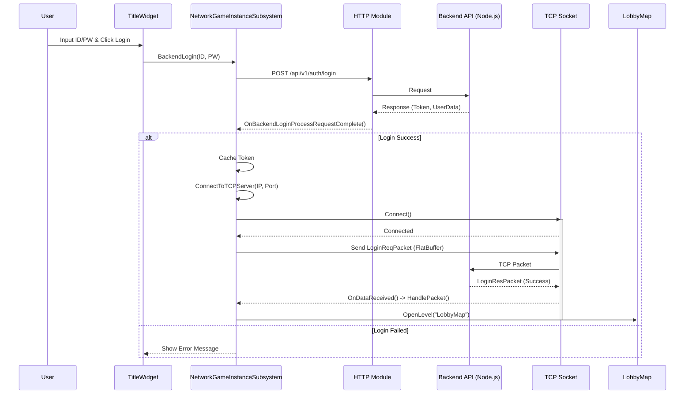
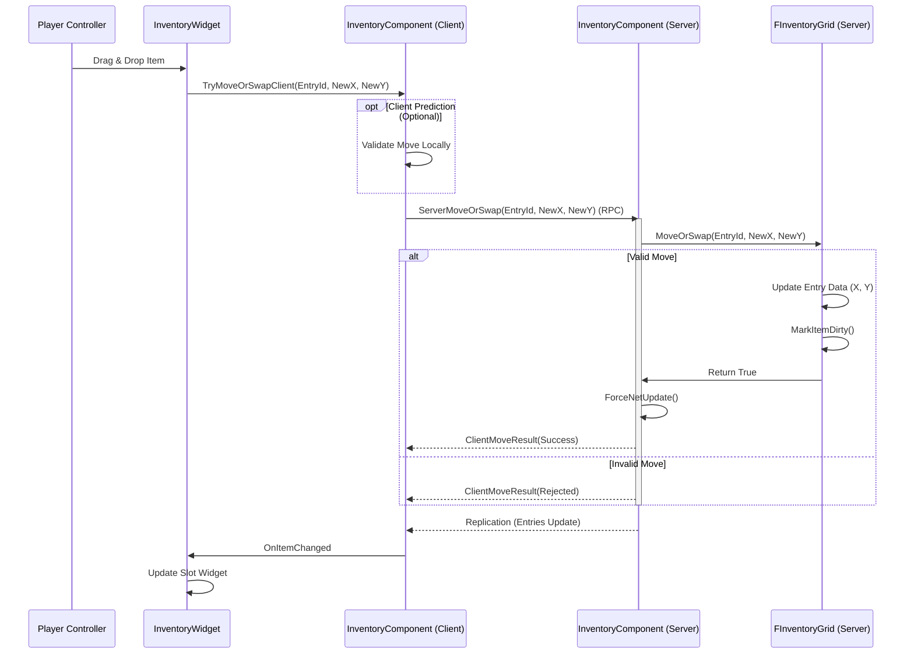
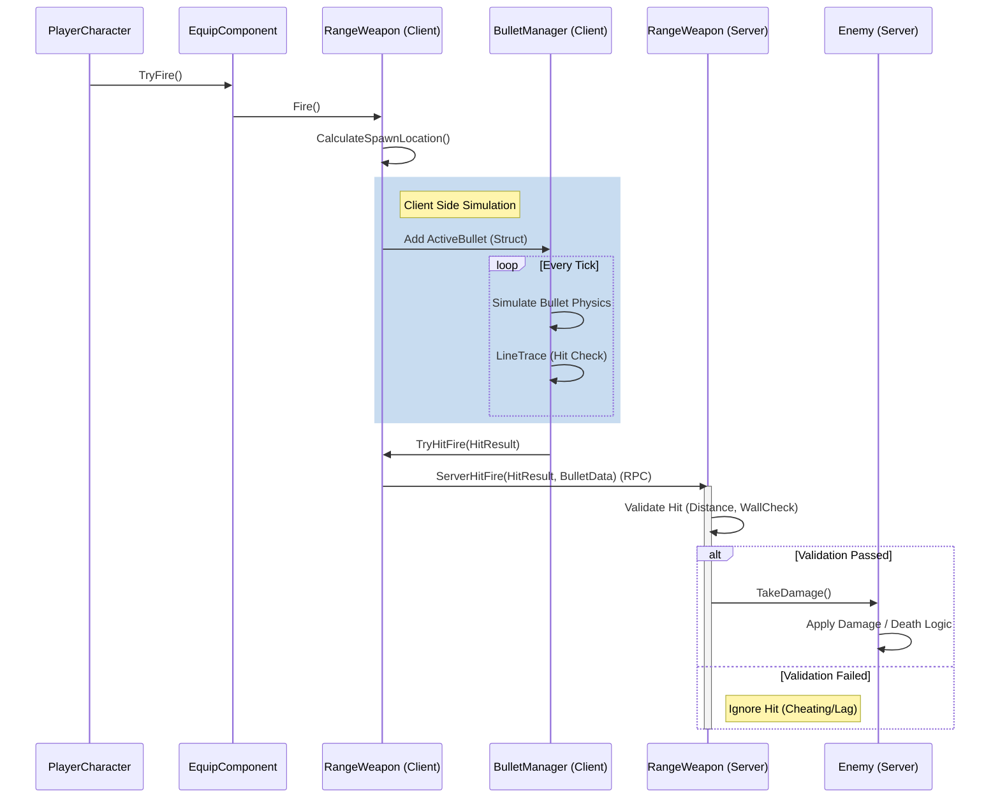
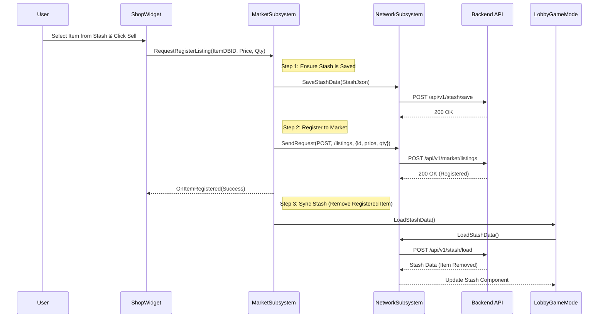
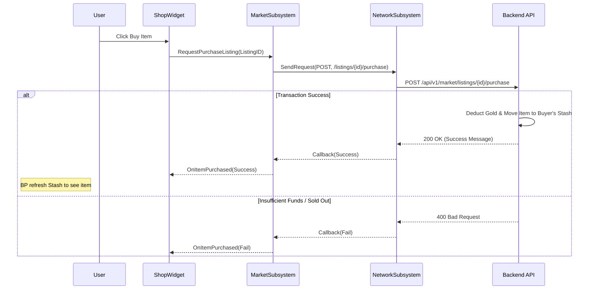
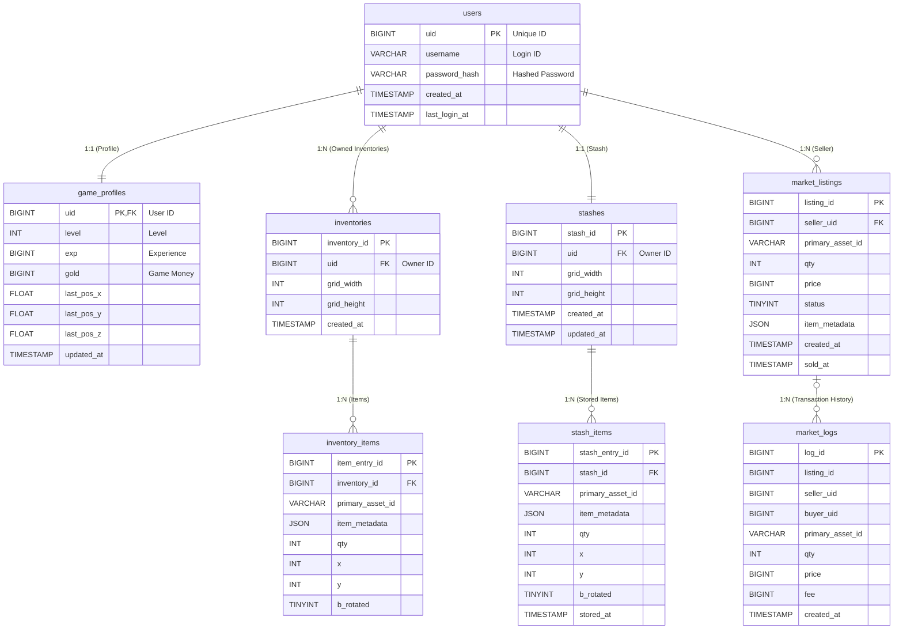
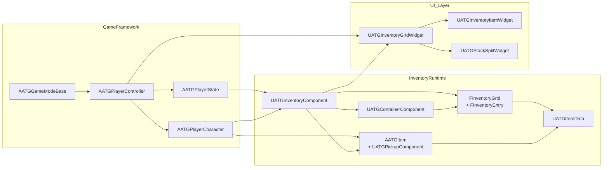

# PROJECT A: TECHNICAL PORTFOLIO

## 1. 프로젝트 개요 (Project Overview)

**프로젝트 명:** ProjectA (Muliplayer Action RPG/Shooter)
**엔진:** Unreal Engine 5.7
**플랫폼:** PC (Windows)
**개발 언어:** C++ (Core), TypeScript (Backend), Blueprints (Prototyping)
**핵심 장르:** 3D TPS Action RPG with Realistic Physics & Networking

**소개 (Introduction):**
ProjectA는 언리얼 엔진 5의 최신 기능을 활용하여 구축된, 깊이 있는 전투와 복잡한 아이템 관리 시스템을 갖춘 멀티플레이어 액션 RPG입니다.
전통적인 슈팅 메커니즘과 정교한 근접 전투(Slicing/Gore)를 결합하고, 백엔드 서비스와의 긴밀한 통합을 통해 영구적인 데이터 관리와 실시간 통신을 지원하는 기술 중심의 프로젝트입니다.

## 2. 핵심 기술 스택 (Core Tech Stack)

| Category | Technology | Usage |
| --- | --- | --- |
| **Engine** | Unreal Engine 5 | Core Game Logic, Physics, Rendering |
| **Physics** | GeometryScript, ProceduralMesh | Dynamic Slicing, Gore System |
| **Networking** | UE5 Replication, Iris Replication, FastArraySerializer | Gameplay Replication, Network Traffic & CPU Optimization, Inventory Sync |
| **Backend** | Node.js, Express, [Socket.IO](http://socket.io/) | Auth, API, Real-time Chat (TCP) |
| **Data** | MySQL, FlatBuffers | Persistent Data, Network Optimization |
| **AI** | Behavior Tree, AIPerception | Enemy Logic, Navigation |

## 3. 주요 시스템  (Key Systems)

### 3.1 인벤토리 & 장비 시스템 (Inventory & Equipment)

**개요:**
"테트리스 스타일"의 공간 관리형 인벤토리 시스템으로, 아이템의 회전과 크기를 고려한 복잡한 배치 알고리즘을 구현했습니다.

- **Grid-Based Logic:** `FInventoryGrid` 구조체를 통해 2D 좌표계 기반의 아이템 배치 검증 및 공간 최적화 알고리즘(`FindFirstFit`, `CanPlaceRect`) 구현.
- **Network Optimization:** `FFastArraySerializer`를 상속받은 커스텀 구조체를 사용하여, 빈번한 아이템 이동/삭제 시 발생하는 네트워크 대역폭을 최소화하고 델타 업데이트만 전송.
- **Data-Driven Design:** `UATGItemData`를 기반으로 한 데이터 테이블(DataAsset) 구조로, 유지보수성과 확장성을 확보하여 `Weapon`, `Consumable` 등 다양한 아이템 타입으로 손쉽게 확장.

### 3.2 전투 및 물리 시스템 (Combat & Physics)

**개요:**
타격감과 물리적 상호작용을 강조한 하이브리드 전투 시스템입니다.

- **Dynamic Gore System:**
    - **Architecture:** `SkeletalMesh` -> `DynamicMesh`(GeometryScript) -> `ProceduralMesh` 로 이어지는 하이브리드 파이프라인 구축.
    - **GeometryScript Usage:** `ApplyMeshPlaneCut`을 사용하여 런타임에 정교한 메쉬 절단 및 단면(Cap) 채우기를 수행하고, `CopyMeshFromSkeletalMesh`로 본 웨이트(Skin Weights) 정보를 보존.
    - **Custom CPU Skinning:** 절단된 메쉬가 애니메이션과 동기화되도록 `ProceduralMeshComponent`의 버텍스를 매 프레임 수동으로 갱신(`UpdatePMCSkinning`). `RefineSkinWeights` 알고리즘을 통해 절단 부위(Stump)와 파편(Debris)의 웨이트를 분리하여, 절단 후 메쉬가 늘어지는(Stretching) 현상을 방지하고 물리 시뮬레이션과 애니메이션의 자연스러운 전환 구현.
- **Hybrid Weapon Logic:**
    - **Range:** 히트스캔(Hit-Scan)과 투사체(Projectile) 방식을 혼합하여 물리적 리얼리티와 네트워크 반응성 균형.
    - **Melee:** `AnimNotifyState`를 활용한 정밀한 히트 박스 제어 및 모션 워핑(Motion Warping)을 통한 타격감 보정.
- **Bullet Manager:** 수백 발의 탄환을 개별 액터가 아닌, `FBullet` 구조체 배열로 관리하는 중앙화된 시뮬레이션 루프(`ABulletManager`)를 구축하여 CPU 오버헤드 대폭 감소.

### 3.3 GAS (Gameplay Ability System) 통합

**개요:**
확장 가능한 스킬 및 상태 관리를 위해 GAS 프레임워크를 전면 도입했습니다.

- **Attribute Management:** `UCharacterAttributeSet`을 통해 체력, 데미지, 스태미나 등의 수치를 서버 권한으로 관리하고 복제.
- **Combo System:** `WaitInputPress`, `WaitMeleeTargetData` 등의 커스텀 태스크(Task)를 작성하여, 입력 타이밍에 따른 분기가 가능한 콤보 공격 어빌리티(`GA_MeleeCombo`) 구현.

### 3.4 백엔드 및 네트워크 아키텍처 (Backend & Networking)

**개요:**
게임플레이와 별도로 작동하는 웹 서버 및 소켓 서버를 통해 메타데이터와 커뮤니케이션을 관리합니다.

- **Authentication & Data:** `UNetworkGameInstanceSubsystem`을 통해 HTTP/RESTful API와 통신하며 로그인, 회원가입, 인벤토리 저장/로드 기능 수행.
- **Secure Transactions:**
    - **Atomic Operations:** 마켓 및 상점 로직(`market.ts`, `shop.ts`)에 `MySQL Transaction`을 적용. `beginTransaction` → `commit`/`rollback` 패턴으로 재화 차감과 아이템 지급의 원자성을 보장.
    - **Concurrency Control:** `SELECT ... FOR UPDATE` 구문을 사용하여 아이템 구매 시 발생할 수 있는 경쟁 상태(Race Condition)를 방지하고 데이터 무결성 확보.
- **Database Schema Design:**
    - **Normalized Structures:** `inventories`, `stashes` 테이블과 아이템 테이블(`inventory_items`, `stash_items`)을 분리하여 1:N 관계를 정규화.
    - **Flexible Metadata:** 아이템의 가변 속성(강화, 내구도, 옵션)은 `JSON` 컬럼(`item_metadata`)으로 설계하여, 스키마 변경 없이 데이터 확장이 용이하도록 구현.
    - **Optimized Indexing:** 거래소 검색 성능을 위해 `idx_market_search(status, primary_asset_id, price)` 복합 인덱스를 적용, 조회 쿼리 속도 최적화.
- **High-Performance Network Protocol:**
    - **FlatBuffers Implementation:** 실시간 통신 패킷에 Google의 **FlatBuffers**를 도입.
    - **Zero-Copy Serialization:** 수신한 패킷 데이터를 별도의 파싱(Unpacking) 과정 없이 메모리 오프셋으로 직접 접근하여 읽는 `Zero-Copy` 특성을 활용, JSON 대비 CPU 사용량을 최소화하고 GC 오버헤드 감소.

### 3.5 대규모 액터 네트워크 동기화 (Massive Actor Replication)

**개요** 
리슨 서버(Listen Server) 환경에서 방장(Host)의 연산 부하를 최소화하기 위해 데이터 지향 설계(DOD) 기반의 Iris(차세대 네트워크 아키텍처)를 도입했습니다.

Iris Replication System 도입:

Push Model Architecture: 매 틱마다 모든 액터의 변경을 감지하는 레거시 폴링(Polling) 방식 대신, 상태가 변경된(Dirty) 데이터만 필터링하여 동기화하는 푸시 모델을 적용해 호스트 PC의 CPU 병목을 원천 차단.

Quantized State Management: 수많은 루팅 아이템과 AI의 네트워크 상태 데이터를 양자화(Quantized)된 저용량 비트 포맷으로 연속된 배열(Array)에 관리. 캐시 히트율(Cache Hit Rate)을 극대화하고 직렬화(Serialization) 오버헤드를 대폭 감소시킴.

---

## 4. 기술적 문제 해결 (Technical Challenges & Solutions)

### Challenge 1: 다수 발사체 동기화로 인한 성능 저하

- **Problem:** 연사 무기 사용 시 수많은 Projectile Actor 생성/파괴로 인한 GC 오버헤드 및 네트워크 부하 발생.
- **Solution:** `ABulletManager`를 도입하여 발사체를 경량 구조체(`struct`)로 변환하고, 단일 매니저가 Tick에서 일괄 업데이트하는 방식으로 변경. 시각적 효과(Trail, Hit Effect)만 클라이언트에서 처리하여 네트워크 대역폭 절약.

### Challenge 2: 실시간 메시 절단(Slicing)의 비용 문제

- **Problem:** 런타임에 Skeletal Mesh를 절단할 때, 버텍스 재계산 비용이 높아 프레임 드랍 발생.
- **Solution:** `GeometryScript`를 활용하여 절단 연산을 비동기 태스크로 분리하거나 중요도가 낮은 본(Bone)은 단순 파괴 처리. 절단면의 UV를 미리 계산된 패턴으로 매핑하여 렌더링 부하 최소화.

### Challenge 3: 복잡한 인벤토리 데이터의 동기화

- **Problem:** 아이템의 위치(Grid Index), 회전, 상태 등이 변경될 때마다 전체 배열을 복제하면 대역폭 낭비가 심함.
- **Solution:** 언리얼 엔진의 `FFastArraySerializer`를 활용하여 변경된 항목(Dirty Item)만 감지하고, 해당 델타 데이터만 클라이언트로 전송하도록 구조 개선.

### Challenge 4: 리슨 서버(Listen Server) 환경의 대규모 오브젝트 동기화 병목
- **Problem** 익스트랙션 장르 특성상 맵 전역에 수천 개의 루팅 아이템, 탄약, AI가 배치됨. 이를 스팀 리슨 서버에서 기존 언리얼 레거시 네트워크(Polling)로 동기화할 경우, 인게임 렌더링과 서버 연산을 동시에 수행해야 하는 방장(Host) PC의 메인 스레드에 과부하가 발생하여 전체 세션의 심각한 프레임 드랍 및 네트워크 지연(Lag)이 유발됨.
- **Solution** 대규모 동기화에 특화된 Iris Replication System을 선제적으로 활성화하여 아키텍처 전면 개편. 데이터 지향 설계(DOD) 기반의 멀티스레드 패킷 처리와 양자화(Quantized)된 상태 전송을 통해 서버 연산 비용을 획기적으로 낮춤.

---

## 5. 향후 로드맵 (Future Roadmap)

- **Advanced AI:** EQS(Environment Query System)를 활용한 전술적 엄폐 및 협동 공격 패턴 추가.
- **Seamless World:** 월드 파티션(World Partition) 도입을 통한 대규모 오픈 월드 확장.
- **Cross-Platform Backend:** gRPC 기반의 마이크로서비스 아키텍처로 백엔드 고도화.

```mermaid
classDiagram
    %% Core Framework
    class AGameModeBase
    class AGameStateBase
    class APlayerController
    class ACharacter
    class APawn
    class AActor
    class UActorComponent
    class UPrimaryDataAsset
    class UGameInstanceSubsystem
    class UUserWidget

    %% Game Modes & States
    class AATGGameModeBase {
        +InitGame()
        +PreLogin()
        +PostLogin()
    }
    class ALobbyGameMode
    class ATitleGameMode
    class ALobbyGameState {
        +int32 LeftTime
    }
    
    AGameModeBase <|-- AATGGameModeBase
    AGameModeBase <|-- ALobbyGameMode
    AGameModeBase <|-- ATitleGameMode
    AGameStateBase <|-- ALobbyGameState

    %% Player Controllers
    class AATGPlayerController {
        +SetupInputComponent()
    }
    class ALobbyPC
    class ATitlePC

    APlayerController <|-- AATGPlayerController
    APlayerController <|-- ALobbyPC
    APlayerController <|-- ATitlePC

    %% Characters & AI
    class AATGPlayerCharacter {
        +UAbilitySystemComponent* AbilitySystemComponent
        +UATGPlayerEquipComponent* PlayerEquipComp
        +UMeleeComponent* MeleeComp
    }
    class AZombieEnemy {
        +USliceSystemComponent* SliceSystemComponent
        +EMonsterState MonsterState
    }
    class ABaseAIController {
        +UAIPerceptionComponent* AIPerceptionComponent
    }

    ACharacter <|-- AATGPlayerCharacter
    ACharacter <|-- AZombieEnemy
    AAIController <|-- ABaseAIController
    ABaseAIController --> AZombieEnemy : Possesses

    %% Components
    class UATGInventoryComponent {
        +FInventoryGrid Inventory
    }
    class UATGEquipmentComponent {
        +FInventoryEntry FirstMainWeapon
        +FInventoryEntry SecondMainWeapon
    }
    class UATGContainerComponent {
        +FInventoryGrid ContainerInventory
    }
    class UATGPlayerEquipComponent {
        +TArray~FEquipmentSlot~ EquipmentSlots
    }
    class UMeleeComponent
    class USliceSystemComponent
    class UATGPickupComponent

    UActorComponent <|-- UATGInventoryComponent
    UActorComponent <|-- UATGEquipmentComponent
    UActorComponent <|-- UATGContainerComponent
    UActorComponent <|-- UATGPlayerEquipComponent
    UActorComponent <|-- UMeleeComponent
    UActorComponent <|-- USliceSystemComponent
    UActorComponent <|-- UATGPickupComponent

    %% Data Assets
    class UATGItemData {
        +FText DisplayName
        +EItemType ItemType
        +UTexture2D* Icon
        +UStaticMesh* Mesh
    }
    class UATGEquipmentData
    class UATGWeaponData {
        +EWeaponType WeaponType
        +USkeletalMesh* WeaponSkeletalMesh
    }
    class UATGRangeWeaponData {
        +FWeaponBulletData WeaponBulletData
    }
    class UATGMeleeWeaponData {
        +TSubclassOf~AATGMeleeWeapon~ WeaponClass
    }
    class UATGConsumableItemData

    UPrimaryDataAsset <|-- UATGItemData
    UATGItemData <|-- UATGEquipmentData
    UATGItemData <|-- UATGConsumableItemData
    UATGEquipmentData <|-- UATGWeaponData
    UATGWeaponData <|-- UATGRangeWeaponData
    UATGWeaponData <|-- UATGMeleeWeaponData

    %% Combat Actors
    class AATGWeaponBase {
        +USkeletalMeshComponent* Mesh
        +UATGWeaponData* WeaponData
    }
    class AATGRangeWeapon {
        +Fire()
    }
    class AATGMeleeWeapon {
        +StartHitCheck()
    }
    class AATGItem {
        +UATGPickupComponent* PickupComp
    }
    class ABulletManager
    class AProjectileBase

    AActor <|-- AATGWeaponBase
    AActor <|-- AATGItem
    AActor <|-- ABulletManager
    AActor <|-- AProjectileBase
    AATGWeaponBase <|-- AATGRangeWeapon
    AATGWeaponBase <|-- AATGMeleeWeapon

    %% Subsystems
    class UNetworkGameInstanceSubsystem {
        +BackendLogin()
        +ConnectToTCPServer()
    }
    class USteamSessionSubsystem {
        +CreateGameSession()
        +FindGameSessions()
    }
    class UMarketSubsystem {
        +RequestMarketListings()
    }
    class UBulletManagerWorldSubsystem

    UGameInstanceSubsystem <|-- UNetworkGameInstanceSubsystem
    UGameInstanceSubsystem <|-- USteamSessionSubsystem
    UGameInstanceSubsystem <|-- UMarketSubsystem
    UTickableWorldSubsystem <|-- UBulletManagerWorldSubsystem

    %% Interfaces
    class IATGInterface {
        <<Interface>>
        +PlayerInteract()
    }
    class IATGInventoryOwnerInterface {
        <<Interface>>
        +GetInventory()
    }
    class IDamageableInterface {
        <<Interface>>
        +ApplyDamage()
    }
    class IAbilitySystemInterface {
        <<Interface>>
        +GetAbilitySystemComponent()
    }
    class IMeleeWeaponInterface {
        <<Interface>>
        +StartHitCheck()
    }

    %% Relationships
    AATGPlayerCharacter ..|> IAbilitySystemInterface
    AATGPlayerCharacter ..|> IGenericTeamAgentInterface
    AZombieEnemy ..|> IAbilitySystemInterface
    AZombieEnemy ..|> IDamageableInterface
    UATGInventoryComponent ..|> IATGInventoryOwnerInterface
    UATGEquipmentComponent ..|> IATGInventoryOwnerInterface
    UATGContainerComponent ..|> IATGInventoryOwnerInterface
    UATGContainerComponent ..|> IATGInterface
    UATGPickupComponent ..|> IATGInterface
    AATGMeleeWeapon ..|> IMeleeWeaponInterface

    %% Aggregations
    AATGPlayerCharacter *-- UATGPlayerEquipComponent
    AATGPlayerCharacter *-- UMeleeComponent
    AATGItem *-- UATGPickupComponent
    UATGInventoryComponent *-- FInventoryGrid
    UATGContainerComponent *-- FInventoryGrid
    UATGPlayerEquipComponent o-- AATGWeaponBase
    AATGWeaponBase o-- UATGWeaponData
    FInventoryGrid o-- FInventoryEntry
    FInventoryEntry o-- UATGItemData

    %% Structs (Representation)
    class FInventoryGrid {
        +TArray~FInventoryEntry~ Entries
        +int32 GridWidth
        +int32 GridHeight
    }
    class FInventoryEntry {
        +TSoftObjectPtr~UATGItemData~ Item
        +int32 Quantity
    }
    class FEquipmentSlot {
        +EEquipmentSlotType SlotType
        +AActor* EquippedActor
    }

```

# ProjectA Sequence Diagrams

## 1. Login & Connection Flow

This diagram illustrates the hybrid authentication process involving a REST API for initial auth and a TCP socket for real-time features (Chat/Lobby).

## 2. Inventory Item Move Flow

Shows the client-predicted inventory movement using `FastArraySerializer`.

## 3. Combat System (Hit Verification)

Illustrates the hybrid client-side projectile simulation with server-side hit verification to optimize bandwidth.

# ProjectA Shop Sequence Diagrams

## 1. Market Item Registration Flow (Selling)

This diagram details the process of listing an item on the market. It highlights the critical data integrity step where the client's local stash is first saved to the server before the listing request is processed, ensuring the backend has the latest state. After listing, the stash is reloaded to reflect the removal of the item.

## 2. Market Item Purchase Flow

This diagram illustrates the purchasing process. The transaction logic (gold deduction, item ownership transfer) is handled atomically on the backend.

## 핵심 흐름 요약

---

**플레이어 파이프라인** : `AATGPlayerController`는 입력 매핑 컨텍스트를 설정하고(`SetupInputComponent`), 소유한 `AATGPlayerCharacter`를 통해 이동/상호작용/인벤토리 토글을 처리하며(`DoMove`, `ToggleInventory` 등), `AATGPlayerState`는 `UATGInventoryComponent`를 서브오브젝트로 생성해 플레이어 인벤토리를 보관합니다.

---

**인벤토리 컴포넌트**: `UATGInventoryComponent`는 `IATGInventoryOwnerInterface`를 구현하며 `FInventoryGrid`(`FastArray` 구조)의 소유자로서, 추가/이동/정렬/분할/드랍과 같은 서버 RPC를 제공하고 클라이언트 이벤트 델리게이트를 브로드캐스트합니다.

---

**`FastArray` 데이터 모델**: `FInventoryGrid`는 각 `FInventoryEntry`를 `FastArray` 방식으로 복제해 슬롯 배치, 겹침 검사, 스택 병합/분할, 자동 정렬 등의 연산을 제공합니다. 이는 컨테이너/플레이어 인벤토리 모두에서 재사용됩니다.

---

**월드 아이템 및 상호작용**: `AATGItem`의 `UATGPickupComponent`는 `IATGInterface`를 통해 플레이어 상호작용(`FInteractionData`)을 처리하며, 소프트 레퍼런스로 'UATGItemData'를 로드해 아이템 크기/아이콘/스택 정보를 제공합니다.

---

 **컨테이너 시스템**: `UATGContainerComponent` 역시 `IATGInterface`를 구현하며 자체 `FInventoryGrid`를 복제해 상호작용 시 플레이어에게 다른 그리드를 열어 줍니다.

---

 **UI 계층**: `UATGInventoryGirdWidget`는 그리드, 셀 스킨, 드래그/드롭 처리를 담당하고, 각 엔트리를 `UATGInventoryItemWidget`으로 표현하며, 스택 나누기 UI(`UATGStackSplitWidget`)를 호출해 분할 수량을 받아옵니다.

---
 
**서버/클라이언트 연계** `UATGInventoryComponent`는 서버 RPC로 아이템 추가/이동/드랍을 처리하고, 성공/실패 결과를 클라이언트 콜백으로 돌려주며, 필요 시 월드에 `AATGItem`을 스폰해 드랍합니다.

---
