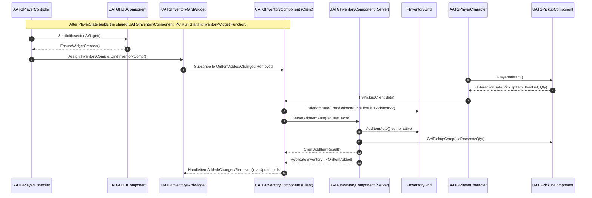

# 그리드 인벤토리 시스템

UE5 그리드 인벤토리 시스템입니다.
- 온라인 플레이 지원 (데디케이트 서버)
- FastArray 사용 네트워크 최적화
- 기능 컴포넌트 모듈화
- C++ 로 작성
- 블루프린트 지원

## 주요 기능

월드 아이템 줍기

아이템 이동

아이템 스택 분할

아이템 스택 병합

아이템 월드 드랍

## 핵심 흐름 요약

---

**플레이어 파이프라인** : `AATGPlayerController`는 입력 매핑 컨텍스트를 설정하고(`SetupInputComponent`), 소유한 `AATGPlayerCharacter`를 통해 이동/상호작용/인벤토리 토글을 처리하며(`DoMove`, `ToggleInventory` 등), `AATGPlayerState`는 `UATGInventoryComponent`를 서브오브젝트로 생성해 플레이어 인벤토리를 보관합니다.

---

**인벤토리 컴포넌트**: `UATGInventoryComponent`는 `IATGInventoryOwnerInterface`를 구현하며 `FInventoryGrid`(`FastArray` 구조)의 소유자로서, 추가/이동/정렬/분할/드랍과 같은 서버 RPC를 제공하고 클라이언트 이벤트 델리게이트를 브로드캐스트합니다.

---

**`FInventoryGrid`**: `FInventoryGrid`는 슬롯 배치, 겹침 검사, 스택 병합/분할, 자동 정렬 등의 연산을 제공합니다. 이는 컨테이너/플레이어 인벤토리 모두에서 재사용됩니다.

---

**`FastArray` 데이터 모델**: `FInventoryGrid`는 각 `FInventoryEntry`를 `FastArray` 방식으로 복제해 네트워크 트래픽을 최적화합니다. `FastArray`는 Dirty 기반의 Diff Replication 최적화를 통해 트래픽을 줄입니다. 배열이 변경된 경우 `MarkItemDirty()` `MarkArrayDirty()`를 호출해 `ReplicationKey`를 증가시킵니다. 

---

**월드 아이템 및 상호작용**: `AATGItem`의 `UATGPickupComponent`는 `IATGInterface`를 통해 플레이어 상호작용(`FInteractionData`)을 처리하며, 소프트 레퍼런스로 'UATGItemData'를 로드해 아이템 크기/아이콘/스택 정보를 제공합니다.

---

 **컨테이너 시스템**: `UATGContainerComponent` 역시 `IATGInterface`를 구현하며 자체 `FInventoryGrid`를 복제해 상호작용 시 플레이어에게 다른 그리드를 열어 줍니다.

---

 **UI 계층**: `UATGInventoryGirdWidget`는 그리드, 셀 스킨, 드래그/드롭 처리를 담당하고, 각 엔트리를 `UATGInventoryItemWidget`으로 표현하며, 스택 나누기 UI(`UATGStackSplitWidget`)를 호출해 분할 수량을 받아옵니다.

---
 
**서버/클라이언트 연계** `UATGInventoryComponent`는 서버 RPC로 아이템 추가/이동/드랍을 처리하고, 성공/실패 결과를 클라이언트 콜백으로 돌려주며, 필요 시 월드에 `AATGItem`을 스폰해 드랍합니다.

---
