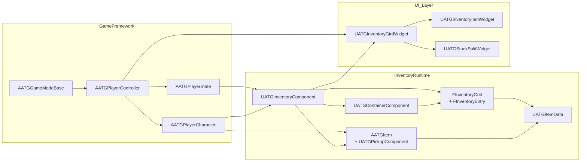

```mermaid
graph LR
  %% =========================
  %% Game / Player Framework
  %% =========================
  subgraph GameFramework
    GM[AATGGameModeBase]
    PC[AATGPlayerController]
    PS[AATGPlayerState]
    CH[AATGPlayerCharacter]
  end

  %% =========================
  %% Inventory / World Objects
  %% =========================
  subgraph InventoryRuntime
    INV[UATGInventoryComponent]
    GRID[FInventoryGrid<br/>+ FInventoryEntry]
    DATA[UATGItemData]
    PICK[AATGItem<br/>+ UATGPickupComponent]
    CONT[UATGContainerComponent]
  end

  %% =========================
  %% UI
  %% =========================
  subgraph UI_Layer
    UI[UATGInventoryGirdWidget]
    ITEMW[UATGInventoryItemWidget]
    SPLIT[UATGStackSplitWidget]
  end

  %% -------------------------
  %% Game / Player Wiring
  %% -------------------------
  GM --> PC
  PC --> PS
  PC --> CH
  PC --> UI

  %% Player State / Character ↔ Inventory
  PS --> INV
  CH --> INV
  CH --> PICK

  %% Inventory ↔ Data / World Objects
  INV --> GRID
  GRID --> DATA
  PICK --> DATA

  INV --> PICK
  INV --> CONT
  CONT --> GRID

  %% Inventory ↔ UI
  INV --> UI
  UI --> ITEMW
  UI --> SPLIT
```
